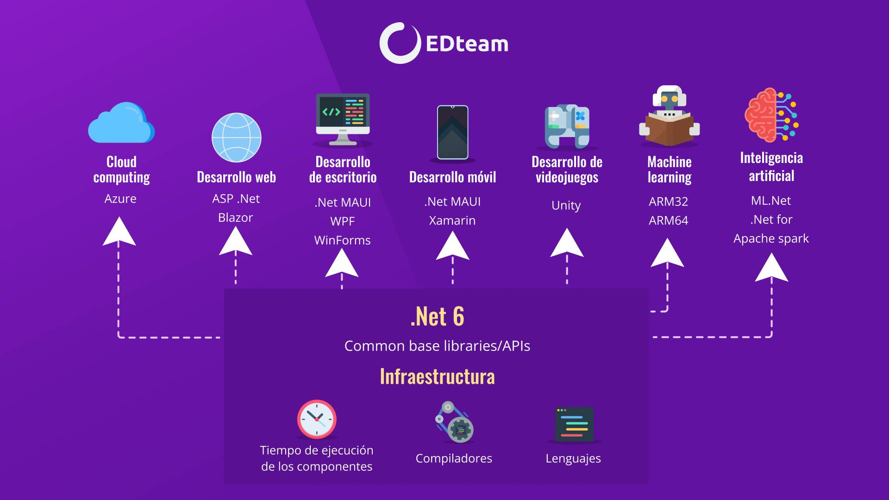

### ¿Qué es .NET?
Es una plataforma de código abierto, para crear aplicaciones de escritorio, web y móviles que se pueden ejecutar de forma nativa en cualquier sistema operativo.

- .Net no es un lenguaje de programación, sino una plataforma de desarrollo
- .Net permite a los desarrolladores crear direferentes tipos de aplicaciones usando varios lenguajes de programación por ejemplo: C#, F#, Visual Basic entre otros.
- Es una plataforma de codigo abierto y multiplataforma
- Es compatible con sistemas operativos Android, Apple, Linux y Windows.
- Esta disponible en varias distribuciones de Linux como Red Hat Enterprise Linux y Ubuntu.

### ¿Qué es C#?
- Es un lenguaje de programación moderno, seguro y orientado a objetos

### Componentes de .NET
- Runtime: ejecuta el código de la aplicación.
- Bibliotecas: proporciona funcionalidad de utilidad como análisis de JSON.
- Compilador: compila código fuente de C# 

### Conceptos
- CLR: convierte a código máquina
- .NET framework: Para aplicaciones Web
- .NET core: Para APIS y apps de terminal

### ¿Qué es ASP .NET?
- Es un marco de trabajo web gratuito y de código abierto, desarrollado por Microsoft, para construir aplicaciones y servicios web modernos usando .NET

.Net 5 es la nueva version

